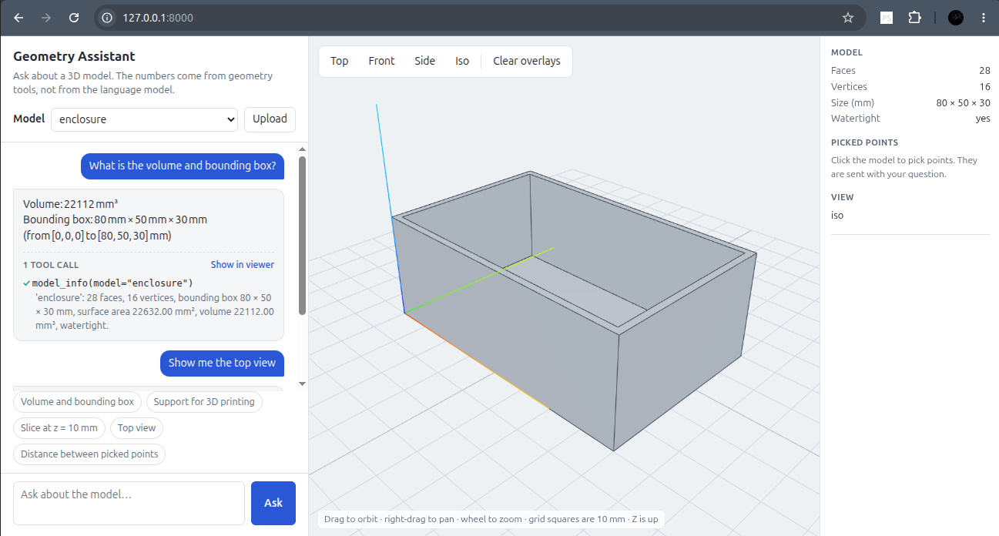
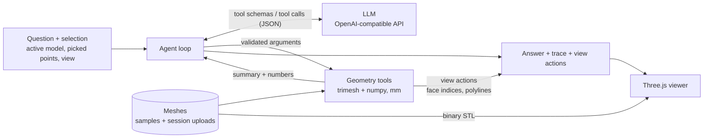

# Geometry Assistant

Load a 3D model, ask questions in plain language, and see the answer on the part: an LLM chooses among whitelisted geometry tools, and every number comes from trimesh, not from the model.

[](https://github.com/rabieessayeh/geometry-assistant/actions/workflows/ci.yml)

[](LICENSE)

Live demo: https://geometry-assistant.onrender.com/



## Try it

Three sample parts are included (an L-bracket, a bridge and an enclosure), and you can upload your own STL or OBJ file. Each of these questions maps to one tool call:

| Question | Tool | Shown in the viewer |
| --- | --- | --- |
| What is the volume and bounding box? | `model_info` | bounding box with its size |
| Highlight the faces that would need support for 3D printing | `overhang_analysis` | faces in red |
| Which faces look towards +x? | `highlight_by_normal` | faces in blue |
| Slice the part at z = 10 mm | `slice_at` | cutting plane and contours |
| Measure the distance between the two points I clicked | `measure_distance` | dimension line with its length |
| Show me the top view | `set_view` | animated camera move |

Click the model to pick points; they are sent with the next question.

## Why

Language models are a convenient interface to 3D data, but they invent figures when asked to compute. Geometry Assistant separates the two jobs:

- **The LLM only decides what to compute.** It picks a tool from a fixed whitelist and fills in its arguments. It never computes geometry and never writes or executes code.
- **Deterministic tools do the computing.** Volumes, areas, cross-sections and distances are produced by trimesh and numpy on the loaded mesh.
- **Every answer is traceable.** The response carries the tool calls that produced it, and the viewer draws their result on the model.

## Features

- Six geometry tools: `model_info`, `highlight_by_normal`, `overhang_analysis`, `slice_at`, `measure_distance`, `set_view`.
- Each tool returns numbers for the LLM and a *view action* for the viewer: faces to highlight, contours to draw, a dimension line, a camera move.
- Tool arguments validated with Pydantic before anything runs. Errors go back to the model so it can correct itself.
- Context engineering: the system prompt describes the loaded models and the user's selection (active model, picked points, current view), so the model can fill in arguments on the first round-trip.
- Any OpenAI-compatible LLM endpoint, hosted or local, with retry and backoff on rate limits.
- Three.js viewer with no build step: orbit controls, point picking, highlights, slice contours, dimension lines, animated standard views.
- JSON API (FastAPI) with interactive docs at `/docs`. Tools can be called directly, without an LLM.
- STL and OBJ upload, validated and kept in memory for the browser session only.
- Evaluation set measuring how often the model picks the right tool and arguments.
- Rate limit on `/ask` for public demos.
- Offline test suite, ruff, Docker image, CI.

## Architecture



- **Deterministic tools.** The LLM receives compact summaries: counts, areas, lengths. Face indices and contour polylines go straight to the viewer and never pass through the model.
- **One source of truth for tools.** Each tool's argument model generates both the JSON schema sent to the LLM and the validation applied to its reply.
- **One mesh on both sides.** The viewer loads every model, uploaded or not, from `GET /models/{id}/mesh`, which serves the mesh the tools work on. Triangle *i* on screen is therefore face *i* of the tools, whatever the original file looked like.
- **Units and axes.** Millimetres, Z up, as in 3D printing.
- **Provider-agnostic LLM.** The agent speaks the OpenAI chat-completions protocol. Switching model or provider means changing three environment variables.

### Rendering

- **Render on demand.** There is no animation loop: a frame is drawn only when the camera, the model, an overlay or the canvas size changes. Camera moves run a loop only while they last.
- **Accelerated picking.** Clicks are resolved against a bounding volume hierarchy ([three-mesh-bvh](https://github.com/gkjohnson/three-mesh-bvh)) instead of testing every triangle.
- **Highlights without extra draw calls per face.** Faces are recoloured through the vertex colours of the single model geometry; one translucent overlay mesh lets highlighted faces hidden from the current viewpoint show through.
- **No leaks on model change.** Geometries, materials, the BVH and label elements are disposed when a model or an overlay is replaced.

## Quick start

Requires Python 3.11 or later.

```bash
git clone https://github.com/rabieessayeh/geometry-assistant.git
cd geometry-assistant
python -m venv .venv && source .venv/bin/activate
pip install -e ".[dev]"

cp .env.example .env        # then set LLM_API_KEY, see "LLM providers"
uvicorn app.api:app --reload
```

Open http://localhost:8000/. Without an API key the viewer and the tools still work; only `/ask` is disabled.

With Docker:

```bash
docker build -t geometry-assistant .
docker run --rm -p 8000:8000 --env-file .env geometry-assistant
```

### API

| Endpoint | Purpose |
| --- | --- |
| `GET /health` | Liveness probe: sample models and configured LLM |
| `GET /models` | Sample models, then the uploads of the session |
| `POST /models` | Upload an STL or OBJ file (multipart field `file`, 10 MB by default) |
| `GET /models/{id}/mesh` | Mesh of a model as binary STL |
| `POST /tools` | Call a tool directly, without the LLM |
| `POST /ask` | Question + selection + history → answer, trace, view actions |

```bash
curl -s localhost:8000/tools -H 'Content-Type: application/json' \
  -d '{"tool": "slice_at", "args": {"model": "enclosure", "axis": "z", "value_mm": 15}}'
```

## LLM providers

The agent works with any endpoint implementing the OpenAI chat-completions API with tool calling. It is configured in `.env`:

| Provider | `LLM_BASE_URL` | `LLM_MODEL` |
| --- | --- | --- |
| Groq (default) | `https://api.groq.com/openai/v1` | `openai/gpt-oss-20b` |
| Local server, e.g. Ollama | `http://localhost:11434/v1` | a model that supports tool calling |
| Other hosted provider | its OpenAI-compatible URL | its model name |

`LLM_API_KEY` holds the key of the provider. `.env` is git-ignored; `.env.example` contains placeholders only.

## Evaluation

`eval/questions.yaml` holds 10 questions with the tool call a correct agent should make. Each one comes with the viewer state it is asked in: the active model, the picked points and the view. The set covers a unit conversion, a model other than the active one, a question in French, a measurement asked with too few picked points, and a question no tool can answer.

```bash
python eval/run_eval.py --delay 2 --out eval/results/run.json
```

The runner reports two figures: **tool accuracy** (the expected tool was called, and no other apart from `model_info`) and **argument accuracy** (it was called with the expected arguments). The wording of the answer is not judged: since every number comes from a deterministic tool, an answer is right when the right tool was called with the right arguments.

Results: _to be added after a run with a real LLM._

## Project structure

```
geometry-assistant/
├── app/
│   ├── geometry.py          # model catalogue, geometry tools, argument models, tool registry
│   ├── agent.py             # context building and LLM tool-calling loop with retry
│   ├── api.py               # FastAPI application
│   ├── sessions.py          # in-memory store of uploads, per browser session
│   ├── config.py            # settings (pydantic-settings) and logging
│   ├── evaluation.py        # scoring of tool choices
│   ├── ratelimit.py         # in-memory rate limiter for /ask
│   └── static/
│       ├── index.html       # page and import map (Three.js from a CDN)
│       ├── style.css
│       └── js/
│           ├── main.js      # wiring: model picker, upload, selection, chat
│           ├── viewer.js    # scene, camera, picking, overlays, on-demand rendering
│           ├── actions.js   # view actions → viewer calls
│           ├── chat.js      # messages, sanitised Markdown, tool-call trace
│           └── api.js       # HTTP client
├── scripts/
│   └── make_sample_models.py  # generate the three sample parts
├── data/samples/            # generated sample parts (STL)
├── eval/
│   ├── questions.yaml       # evaluation set
│   └── run_eval.py          # evaluation runner
├── tests/                   # pytest suite (offline)
├── docs/screenshot.png
├── Dockerfile
├── pyproject.toml           # dependencies, ruff and pytest configuration
└── .github/workflows/ci.yml
```

The sample parts are original: `scripts/make_sample_models.py` builds them from boxes and cylinders, with dimensions the tests check against volumes and areas computed by hand.

## Testing

```bash
ruff check . && ruff format --check .
pytest
```

The suite needs neither network access nor an API key. It checks every tool against known values (the volume of a box, the section of the enclosure, the overhang of the bridge deck), argument validation, upload validation, the retry logic, the rate limit, the HTTP endpoints through FastAPI's `TestClient`, the evaluation scoring, and the agent loop driven by a scripted fake LLM. The same commands run in CI on every push.

The front-end has no automated tests.

## Deployment notes

The Docker image listens on `$PORT` (8000 by default) and limits `/ask` to 10 questions per hour per visitor (`ASK_RATE_LIMIT`, `ASK_RATE_WINDOW_S`); `ASK_GLOBAL_LIMIT` caps all visitors together and is off unless set. Uploads and rate-limit counters live in memory: they are bounded (`MAX_UPLOAD_MB`, `MAX_FACES`, `MAX_UPLOADS_PER_SESSION`, `MAX_SESSIONS`) and reset when the container restarts.

## Limitations and roadmap

- `overhang_analysis` is a per-face angle test. It does not model bridging, so a short span printable without support is still reported.
- Meshes only. A CAD kernel such as Open CASCADE would bring STEP files and exact B-rep queries: hole diameters, fillet radii, face types.
- More tools: wall thickness, hole detection, mass from a material density, comparison of two models.
- WebGPU renderer.
- Answer-level evaluation, in addition to tool and argument accuracy.

## License

[MIT](LICENSE)

## Author

**Rabie ES-SAYEH** · [GitHub](https://github.com/rabieessayeh) · [Portfolio](https://rabieessayeh.github.io/profile/)
